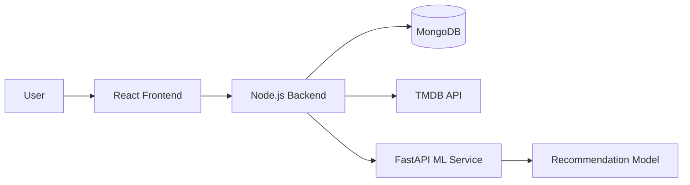
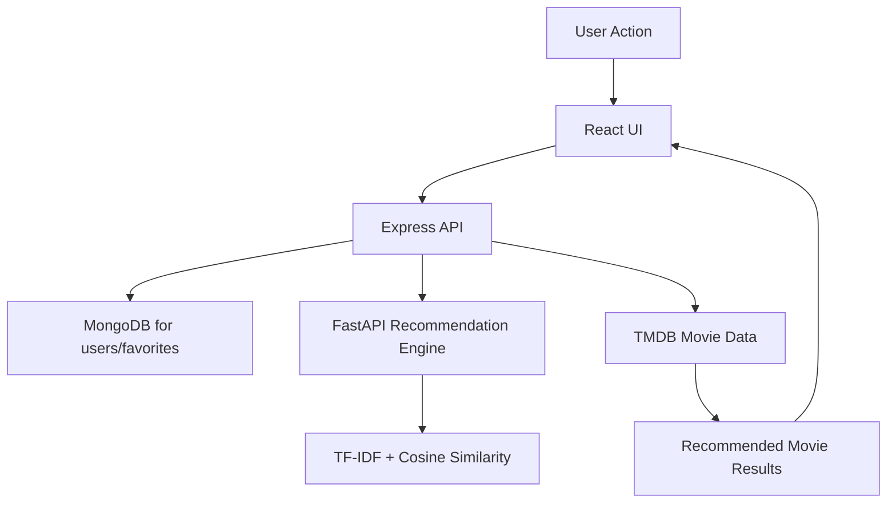

# 🎬 Movie Recommendation System

A full-stack movie discovery and recommendation application that combines machine learning, FastAPI, Node.js, React, and the TMDB API to recommend movies based on content similarity.

## 🚀 Features

- 🔐 User authentication with JWT
- ❤️ Favorite movies management
- 🎥 Movie browsing and details from TMDB
- 🔍 Search for movies
- 🤖 Content-based movie recommendations
- 📱 Responsive and modern UI
- ⚡ Fast recommendation engine using FastAPI

## 🛠 Tech Stack

### Frontend
- React.js
- Vite
- Axios
- React Router
- Tailwind CSS
- Redux Toolkit

### Backend
- Node.js
- Express.js
- MongoDB
- Mongoose
- JWT Authentication

### Machine Learning
- Python
- FastAPI
- Pandas
- NumPy
- Scikit-learn
- TF-IDF Vectorizer
- Cosine Similarity

### External Services
- TMDB API
- MongoDB Atlas

## 📁 Project Structure

```text
MovieRecommendationSystem/
├── frontend/           # React + Vite client app
├── backend/            # Express.js API and MongoDB logic
├── ML_NLP/             # FastAPI recommendation service
├── .gitignore
└── README.md
```

## 🧠 System Architecture



## 🔄 Recommendation Workflow

1. The user searches or opens a movie in the frontend.
2. The React app sends a request to the Node.js backend.
3. The backend forwards the request to the FastAPI recommendation service.
4. The ML service computes similar movies using TF-IDF and cosine similarity.
5. The backend fetches movie details from TMDB.
6. The final recommended movie list is returned to the frontend.

## 📊 Data Flow Diagram



## ⚙️ Installation

### 1. Clone the repository

```bash
git clone https://github.com/rituranjankumar/MovieRecommendationSystem.git
cd MovieRecommendationSystem
```

### 2. Frontend Setup

```bash
cd frontend
npm install
npm run dev
```

The frontend will run at `http://localhost:5173`.

### 3. Backend Setup

```bash
cd backend
npm install
npm run dev
```

The backend will run at `http://localhost:5000`.

### 4. FastAPI Setup

```bash
cd ML_NLP
python -m venv venv

# Windows
venv\Scripts\activate

# macOS/Linux
source venv/bin/activate

pip install -r requirements.txt
uvicorn app:app --reload --port 8000
```

The ML service will run at `http://localhost:8000`.

## 🌐 Environment Variables

### Backend (.env)

```env
PORT=5000
MONGO_URI=YOUR_MONGODB_URI
JWT_SECRET=YOUR_SECRET
TMDB_API_KEY=YOUR_TMDB_API_KEY
TMDB_BASE_URL=https://api.themoviedb.org/3
CLIENT_URL=http://localhost:5173
```

### Frontend (.env)

```env
VITE_API_URL=http://localhost:5000
```

## 🚀 Deployment

- Frontend: Vercel
- Backend: Render or Railway
- ML Service: Render or Railway
- Database: MongoDB Atlas
- Movie Data: TMDB API

## 🔮 Future Improvements

- Collaborative filtering
- Recommendation caching
- Redis integration
 

## 👨‍💻 Author

**Rituranjan Kumar**

B.Tech (Information Technology)

IIIT Bhubaneswar

## 📄 License

This project is intended for educational and learning purposes.
